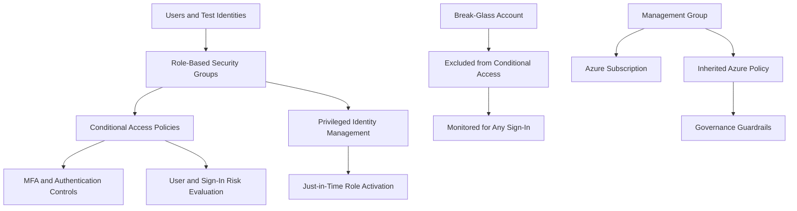

# Phase 1: Identity Fortress
### Zero Trust Identity and Governance Foundation for Secure AI Workloads

**Contoso AI Labs | Microsoft Azure | Zero Trust | Identity Governance**

---

## Executive Summary

Before deploying any AI workload, I established the identity and governance controls that determine **who can access the environment, under what conditions, and with what level of privilege**.

This phase implemented role-based security groups, Conditional Access, risk-based controls, Privileged Identity Management (PIM), a monitored emergency-access account, Azure Policy, and Management Group inheritance. The resulting environment reduces exposure to compromised credentials, standing administrative privilege, legacy authentication, risky sign-ins, and resource misconfiguration.

> **Outcome:** A Zero Trust identity perimeter and governance baseline were implemented and validated before any production-style AI resource was deployed.

---

## Project Snapshot

| Category | Details |
|---|---|
| **Platform** | Microsoft Azure and Microsoft Entra ID |
| **Environment** | Personal Azure tenant |
| **Primary focus** | Identity security, least privilege, Conditional Access, privileged access, governance |
| **Key services** | Microsoft Entra ID, Conditional Access, Identity Protection, PIM, Azure Policy, Management Groups |
| **Threats addressed** | Compromised credentials, privilege escalation, password spraying, risky sign-ins, configuration drift |
| **Framework alignment** | NIST 800-207, CIS Microsoft Azure Foundations, Microsoft Cloud Adoption Framework |
| **Validation** | Sign-in-log review, policy enforcement checks, PIM validation, policy inheritance confirmation |

---

## Security Challenge

The AI workload did not yet exist, but the access model had to be designed first. Deploying infrastructure before identity controls would have created an environment where permissions, emergency access, privileged roles, and governance were added reactively instead of being built into the foundation.

The two primary risks addressed were **compromised credentials** and **privilege escalation**. The design therefore needed to enforce least privilege, reduce standing administrative access, block weaker authentication paths, evaluate sign-in risk, preserve emergency access, and prevent authorized users from creating insecure resources.

---

## Solution Architecture

---

## What I Implemented

### Identity Structure

| Group | Purpose |
|---|---|
| **AI-Admins** | Administrative access to the AI environment, with privileged access controlled through PIM |
| **AI-Developers** | Deployment, configuration, and testing responsibilities |
| **AI-Users** | Approved consumption of AI services without administrative permissions |

Test identities were assigned to the appropriate groups so that future access decisions could be managed through group membership rather than direct user-by-user assignments.

### Conditional Access

| Policy | Control |
|---|---|
| **CA01** | Require MFA for all users except the emergency-access account |
| **CA02** | Block legacy authentication |
| **CA03** | Block sign-ins from selected high-risk countries |
| **CA04** | Require more frequent sign-in for administrators |
| **CA05** | Require remediation for high user risk |
| **CA06** | Require MFA for medium- and high-risk sign-ins |

Policies were evaluated in **report-only mode** where appropriate, then moved to enforcement after sign-in logs confirmed expected behavior.

### Privileged Access

PIM was used to make the administrative test identity **eligible** for Global Reader rather than permanently assigned. Activation required MFA, approval, justification, ticket information, and a four-hour activation window.

### Emergency Access

A dedicated break-glass account was created with Global Administrator access and excluded from Conditional Access so tenant recovery remains possible if normal authentication controls fail. The credential was stored offline, the account was excluded from daily administration, and any sign-in was designated for high-priority monitoring in Phase 5.

### Governance Baseline

Azure Policy was used to prevent or identify insecure resource configurations. The initial baseline covered managed identity use, Azure AI Services network access, and storage-account network access. A Management Group was added above the subscription, with one policy assigned at that scope to prove inheritance.

---

## Key Engineering Decisions and Tradeoffs

| Decision | Rationale | Tradeoff |
|---|---|---|
| Build identity before infrastructure | Access should be designed before resources are deployed | More setup before visible workload deployment |
| Use groups instead of direct assignments | Improves scalability, consistency, and access reviews | Requires disciplined group governance |
| Test Conditional Access in report-only mode | Reduces lockout risk and validates scope | Delays enforcement until evidence is reviewed |
| Use PIM for privileged access | Reduces standing privilege and blast radius | Adds activation and approval overhead |
| Exclude the break-glass account | Preserves emergency tenant access | Requires strong offline protection and monitoring |
| Assign policy at Management Group scope | Demonstrates enterprise inheritance patterns | Structurally unnecessary for a single-subscription lab |
| Begin selected policies in Audit mode | Reveals impact before blocking deployment | Provides visibility rather than immediate prevention |

---

## Results and Validation

| Result | Validation |
|---|---|
| Function-based identity model established | Three security groups and three test users mapped to distinct job functions |
| MFA enforcement validated | Test sign-in confirmed Conditional Access success and MFA enforcement |
| Legacy authentication blocked | CA02 removed a common password-spray path |
| Risk-aware controls created | Separate user-risk and sign-in-risk policies were implemented |
| Standing privilege reduced | Administrative test identity was made PIM-eligible instead of permanently privileged |
| Emergency access preserved | Dedicated break-glass account created and excluded from Conditional Access |
| Governance controls enforced | Azure Policy assignments confirmed at subscription and Management Group scopes |
| Policy inheritance proven | Management Group policy appeared in the subscription compliance view without duplicate assignment |
| Report-only controls enforced | CA01 and CA04 were validated through sign-in logs and enabled |

---

## Evidence

| Control | What it proves | Screenshot |
|---|---|---|
| Role-based groups | Three groups map to distinct job functions |  |
| Test identities | Users were provisioned and assigned by role |  |
| Break-glass account | Emergency-access identity was configured separately |  |
| Named locations | Trusted and blocked locations were defined |  |
| Core CA policies | MFA, legacy-authentication, geography, and admin-session controls were created |  |
| PIM | Privileged access was implemented as an eligible assignment |  |
| Risk-based CA | User-risk and sign-in-risk controls were separated |  |
| Policy baseline | Initial Azure Policy assignments were applied |  |
| Management Group | Governance hierarchy was introduced |  |
| Policy inheritance | Management Group policy inherited to the subscription |  |
| Enforcement | Report-only controls were validated and enabled |  |

---

## Framework Mapping

| Framework | Application |
|---|---|
| **NIST 800-207 Zero Trust** | Verify explicitly, use least privilege, and assume credentials may be compromised |
| **CIS Microsoft Azure Foundations** | MFA, privileged-access controls, legacy-authentication blocking, and identity governance |
| **Microsoft Cloud Adoption Framework** | Identity baseline, governance hierarchy, policy inheritance, and separation of duties |

---

## Lessons Learned

### Standing privilege is a design risk
PIM demonstrated that privileged access does not need to be permanently active. Time-bound eligibility reduces the impact of a compromised account while preserving administrative capability.

### Report-only is part of safe deployment
A technically correct Conditional Access policy can still lock out legitimate users if scoped incorrectly. Testing against sign-in logs before enforcement is part of the implementation process.

### Identity and governance solve different problems
Conditional Access and PIM determine whether a person should be allowed to act. Azure Policy determines whether the action or resulting configuration is permitted.

### Enterprise patterns can be demonstrated at lab scale
The Management Group was unnecessary for one subscription, but it demonstrated how policies can inherit across Dev, Test, and Production subscriptions.

---

## Repository Navigation

- **Detailed implementation:** [Phase 1 Runbook](./runbooks/01-identity-fortress-runbook.md)
- **Next phase:** [Phase 2 — Network Architecture & Isolation](./02-network-architecture.md)
- **Project overview:** [Secure AI Deployment on Azure](../README.md)

---

**Phase 1 complete — identity became the first security boundary of the environment.**

